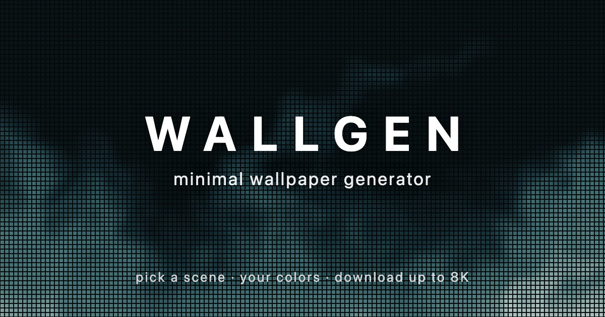
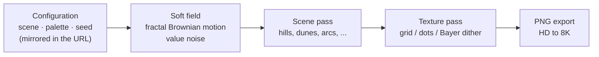

<div align="center">



<br/><br/>

[](https://react.dev)
[](https://www.typescriptlang.org)
[](https://vite.dev)
[](https://tailwindcss.com)
[](LICENSE)

A minimal wallpaper generator — procedural dithered-gradient scenes rendered<br/>entirely
in your browser, downloadable up to 8K. Free, no login, no tracking.

**[wallgen.sunnydx.dev](https://wallgen.sunnydx.dev)**

[Features](#features) · [How it works](#how-it-works) · [Link previews](#link-previews) · [Getting started](#getting-started) · [Deployment](#deployment)

</div>

---

## Features

- **Ten scenes** — mist, smoke, blobs, waves, hills and pines, wave, dunes, mountains, arcs, and scribble.
- **Five textures** — grid, dots, soft dots (LED-matrix style: gaps darken the local color), 8×8 Bayer ordered dithering, or smooth gradients.
- **Your colors** — curated palettes or fully custom colors, with light and dark backgrounds.
- **Reproducible and shareable** — generation is seeded (mulberry32) and the URL always mirrors the full configuration, so any wallpaper can be recreated or shared by link.
- **Up to 8K** — export PNG at HD, Full HD, QHD, 4K, 5K, or 8K, for desktop and phone.
- **Fully client-side** — wallpapers render in your browser, with no accounts and no analytics; nothing you make leaves your machine unless you share its link.
- **Rich link previews** — a shared link unfurls in WhatsApp, iMessage, Telegram, Discord, Slack and X with that exact wallpaper as its preview image.

## How it works

Every wallpaper is drawn on an HTML canvas from a deterministic pipeline:



The interesting parts live in [`src/lib/wallpaper.ts`](src/lib/wallpaper.ts): a seeded
PRNG, 1D and 2D value noise with fractal Brownian motion, color ramps interpolated in
RGB, scene painters, and an 8×8 Bayer matrix for the ordered-dither texture.

## Link previews

Link-preview crawlers don't run JavaScript, so a static site can only ever show one
default card. A small Node server ([`server/`](server)) serves the build instead and,
when a page URL carries a wallpaper config, rewrites the `<title>`, Open Graph and
Twitter tags for that wallpaper — e.g. *Mist · Soft dots · Lagoon — wallgen* — pointing
`og:image` at a server-side render of it.

- **Same renderer, same parsing.** `/og.jpg` and `/og.png` draw with
  [`src/lib/wallpaper.ts`](src/lib/wallpaper.ts) on [`@napi-rs/canvas`](https://github.com/Brooooooklyn/canvas)
  (Skia, like Chrome), and the query is read by [`src/lib/config-url.ts`](src/lib/config-url.ts),
  the same module the app uses — so the preview is the wallpaper the link opens.
- **Full-bleed 1200×630.** No frame or text: the card is the wallpaper itself, which
  survives the square crops some apps apply. Images are JPEG by default and kept under
  ~280 KB, since WhatsApp drops larger previews; set `OG_FORMAT=png` for lossless.
- **Cheap and abuse-resistant.** Fixed size only; unknown, repeated or oversized
  parameters get a 400. Renders are cached in memory (LRU) under a normalized key and
  sent as `immutable` (the query fully determines the pixels; `v=` is bumped when the
  renderer changes), run at most two at a time, and cache misses are rate-limited per
  client (rightmost `X-Forwarded-For`, as appended by the reverse proxy).

| Env | Default | |
| --- | --- | --- |
| `PUBLIC_ORIGIN` | `https://wallgen.sunnydx.dev` | absolute origin for `og:url` / `og:image` (never taken from `Host`) |
| `PORT` | `8080` (`80` in Docker) | listen port |
| `OG_FORMAT` | `jpg` | `jpg` or `png` for `og:image` |
| `DIST_DIR` | `dist` | built site to serve |

## Getting started

```bash
npm install
npm run dev                # Vite dev server on :5173
```

```bash
npm run build              # type-checks, then builds dist/
npm start                  # serves dist/ with link previews on :8080
npm test                   # node:test — URL parsing and meta tags
npm run lint               # oxlint
```

## Deployment

`dist/` works as a plain static site (previews then fall back to the default card).
The included `Dockerfile` builds it and runs the preview server on port 80 — Node 24
runs the TypeScript directly, as PID 1, and shuts down cleanly on `SIGTERM`:

```bash
docker build -t wallgen .
docker run -d -p 8080:80 wallgen
```

## License

Released under the [MIT License](LICENSE).
