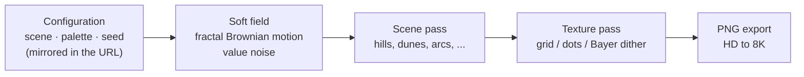

<div align="center">


<br/><br/>

[](https://react.dev)
[](https://www.typescriptlang.org)
[](https://vite.dev)
[](https://tailwindcss.com)
[](LICENSE)

A minimal wallpaper generator — procedural dithered-gradient scenes rendered<br/>entirely
in your browser, downloadable up to 8K. Free, no login, no tracking.

**[wallgen.sunnydx.dev](https://wallgen.sunnydx.dev)**

[Features](#features) · [How it works](#how-it-works) · [Getting started](#getting-started) · [Deployment](#deployment)

</div>

---

## Features

- **Ten scenes** — mist, smoke, blobs, waves, hills and pines, wave, dunes, mountains, arcs, and scribble.
- **Five textures** — grid, dots, soft dots (LED-matrix style: gaps darken the local color), 8×8 Bayer ordered dithering, or smooth gradients.
- **Your colors** — curated palettes or fully custom colors, with light and dark backgrounds.
- **Reproducible and shareable** — generation is seeded (mulberry32) and the URL always mirrors the full configuration, so any wallpaper can be recreated or shared by link.
- **Up to 8K** — export PNG at HD, Full HD, QHD, 4K, 5K, or 8K, for desktop and phone.
- **Fully client-side** — a static site with no backend, no accounts, and no analytics; nothing you make ever leaves your machine.

## How it works

Every wallpaper is drawn on an HTML canvas from a deterministic pipeline:



The interesting parts live in [`src/lib/wallpaper.ts`](src/lib/wallpaper.ts): a seeded
PRNG, 1D and 2D value noise with fractal Brownian motion, color ramps interpolated in
RGB, scene painters, and an 8×8 Bayer matrix for the ordered-dither texture.

## Getting started

```bash
npm install
npm run dev                # Vite dev server on :5173
```

```bash
npm run build              # type-checks, then builds dist/
npm run lint               # oxlint
```

## Deployment

The build output is a static site — host `dist/` anywhere. The included `Dockerfile`
builds it and serves it with nginx:

```bash
docker build -t wallgen .
docker run -d -p 8080:80 wallgen
```

## License

Released under the [MIT License](LICENSE).
